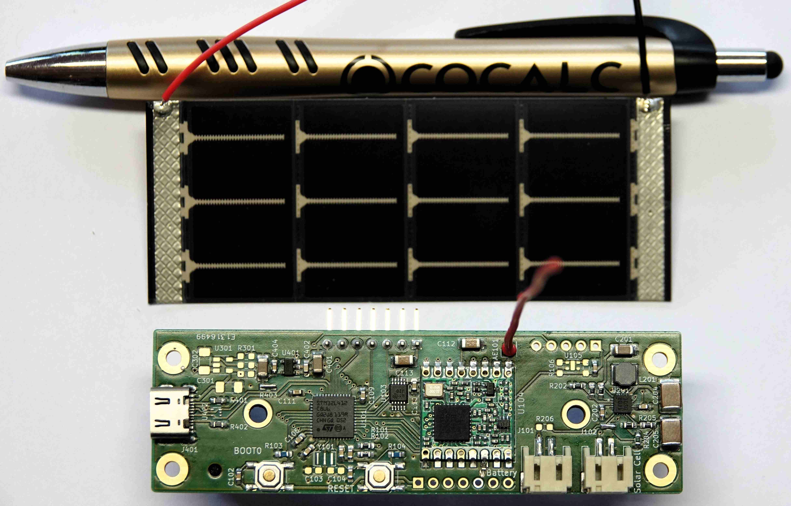

# ComAir

A LoRa air quality sensor powered with an indoor solar pannel.

This PCB uses:
- as MCU: [STM32L412C8](https://www.st.com/en/microcontrollers-microprocessors/stm32l412c8.html)
- for LoRa communication: [RFM95](https://www.hoperf.com/modules/lora/RFM95.html)
- for energy harvesting: [SPV1050](https://www.st.com/en/power-management/spv1050.html)
- any 18650 lithium cell (could be recycled from old laptop battery)
- as solar pannel, one or two: [LL200-4.8-37](https://www.powerfilmsolar.com/products/electronic-component-solar-panels/indoor-light-series/ll200-48-37) 
- for CO2 sensing: [SCD41](https://www.sensirion.com/en/environmental-sensors/carbon-dioxide-sensors/carbon-dioxide-sensor-scd4x/)
- for temperature and humidity: either [SCD41](https://www.sensirion.com/en/environmental-sensors/carbon-dioxide-sensors/carbon-dioxide-sensor-scd4x/) or [SHTC3](https://www.sensirion.com/en/environmental-sensors/humidity-sensors/digital-humidity-sensor-shtc3-our-new-standard-for-consumer-electronics/)

**Warning** this project is still work in progress, PCB may still contain errors.

PCB V1.0 preview:

## TODO

- [ ] Write some basic testing firmware
- [ ] Evaluate energy balance 
- [ ] Optimize energy usage

## License 
- CC-BY-SA